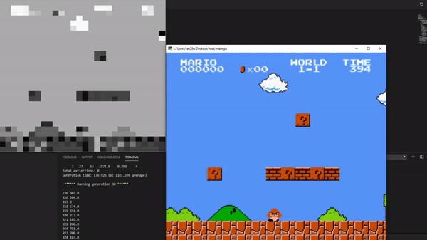

# Mario NEAT
Inspired by SethBling's "MarI/O - Machine Learning for Video Games" video, I implemented the NEAT algorithm on Python using OpenAI Gym Retro and NEAT-python libraries. It tries to tackle the 1st level of the original Super Mario Bros.



##Instructions to run 

```
pip install -r requirements.txt
python -m retro.import rom/SuperMarioBros-Nes.nes
```
##Main Script
```
python main.py
```
Options
```
  -h, --help            show this help message and exit
  --config_file CONFIG_FILE
                        Config NEAT filename with hyperparameters data, Ex:
                        configuration_1
  --generations GENERATIONS
                        Number of generations to compute
```
##Visualization Scripts: 
```
python Plot_Data.py 
```
Options
```
optional arguments:
  -h, --help            show this help message and exit
  --stats_file STATS_FILE
                        Statistics File for Visualization (Ex.: Config_Files/configuration_2_stats_gen_100)
```
```
python Comparing_Plots.py
```
Options
```
  -h, --help            show this help message and exit
  --generation GENERATION
                        Generation number for visualization
  --number_files NUMBER_FILES
                        List of indices of configuration files you want to
                        compare
(Ex.: --generation 50 --number_files 1,2,3
```